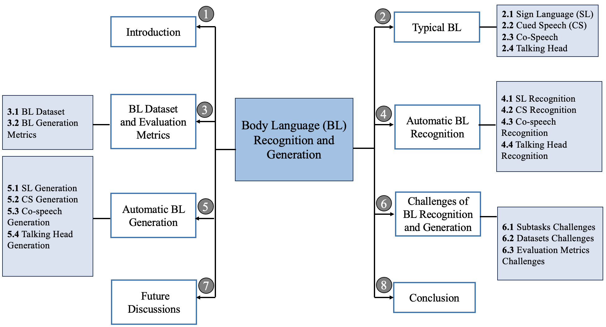

 <!-- # <p align=center>`awesome gan-inversion`</p> -->
[](https://github.com/sindresorhus/awesome)
[](https://github.com/lxtGH/Awesome-Segmenation-With-Transformer/pulls)

<br />

<p align="center">
  <h1 align="center">A Survey on Deep Multi-modal Learning for Body Language Recognition and Generation</h1>
  <p align="center">
    arXiv, 2023
    <br />
    <a href="/"><strong>Li Liu</strong></a>
    ·
    <a href="/"><strong>Lufei Gao</strong></a>
    ·
    <a href="/"><strong>Wentao Lei</strong></a>
    ·
    <a href="/"><strong>Fengji Ma</strong></a>
    ·
    <a href="/"><strong>Fengji Ma</strong></a>
    <br />
    <a href="/"><strong>Jinting Wang</strong></a>
  </p>

  <p align="center">
    <a href='link'>
      
    </a>
    <a href='link' style='padding-left: 0.5rem;'>
      
    </a>
  </p>
<br />

This repo is used for recording, tracking, and benchmarking some Multi-modal Body Language researchs,
as a supplement to our [survey](link).  
If you find any work missing or have any suggestions (papers, implementations and other resources), please don't hesitate to open an issue or pull request.
We will add the missing papers to this repo ASAP.


### 🔥News
[-2023.8.19] The second draft is on arxiv. 

[-2023.8.7 ] The first draft is on arxiv. 

### 🔥Highlight!!

[1], we re-visit and group the existing Body Language researchs from the **Multi-modal perspective.**

[2], We survey the research in 4 parts: Cued Speech, Co-speech, Sign Language, Talking Head.

[3], Some new insight for this directions are discussed.


## Introduction

In this survey, we present the first detailed survey on Multi-modal Body Language research.



## Summary of Contents

- [Methods: A Survey](#Paper List)
  - [Cued Speech Recognition](#Cued Speech Recognition)
  - [Co-speech Recognition](#Co-speech Recognition)
  - [Sign Language Recognition](#Sign Language Recognition)
  - [Talking Head Recognition](#Talking Head Recognition)


[//]: # (  )

- [Related Domains and Beyond](#Related-Domains-and-Beyond)
    - [Point Cloud Segmentation](#Point-Cloud-Segmentation)
    - [Tuning Foundation Models](#Tuning-Foundation-Models)
    - [Domain-aware Segmentation](#Domain-aware-Segmentation)
    - [Label and Model Efficient Segmentation](#Label-and-Model-Efficient-Segmentation)

## Paper List

### Cued Speech Recognition

| Year |  Venue  |     Acronym     | Paper Title                                                                                                           | Code/Project                                                 |
|:----:|:-------:|:---------------:|-----------------------------------------------------------------------------------------------------------------------|--------------------------------------------------------------|
| 2020 |  CVPR   |      DETR       | [End-to-End Object Detection with Transformers](https://arxiv.org/abs/2005.12872)                                     | [Code](https://github.com/facebookresearch/detr)             |
|      |         |                 |                                                                                                                       |  N/A                                                         |
|      |         |                 |                                                                                                                       |                                                              |
|      |         |                 |                                                                                                                       |                                                              |
|      |         |                 |                                                                                                                       |                                                              |
|      |         |                 |                                                                                                                       |                                                              |

#### Co-speech Recognition

| Year |  Venue  |     Acronym     | Paper Title                                                                                                           | Code/Project                                                 |
|:----:|:-------:|:---------------:|-----------------------------------------------------------------------------------------------------------------------|--------------------------------------------------------------|
| 2020 |  CVPR   |      DETR       | [End-to-End Object Detection with Transformers](https://arxiv.org/abs/2005.12872)                                     | [Code](https://github.com/facebookresearch/detr)             |
|      |         |                 |                                                                                                                       |  N/A                                                         |
|      |         |                 |                                                                                                                       |                                                              |
|      |         |                 |                                                                                                                       |                                                              |
|      |         |                 |                                                                                                                       |                                                              |
|      |         |                 |                                                                                                                       |                                                              |

#### Sign Language Recognition

| Year |  Venue  |     Acronym     | Paper Title                                                                                                           | Code/Project                                                 |
|:----:|:-------:|:---------------:|-----------------------------------------------------------------------------------------------------------------------|--------------------------------------------------------------|
| 2020 |  CVPR   |      DETR       | [End-to-End Object Detection with Transformers](https://arxiv.org/abs/2005.12872)                                     | [Code](https://github.com/facebookresearch/detr)             |
|      |         |                 |                                                                                                                       |  N/A                                                         |
|      |         |                 |                                                                                                                       |                                                              |
|      |         |                 |                                                                                                                       |                                                              |
|      |         |                 |                                                                                                                       |                                                              |
|      |         |                 |                                                                                                                       |                                                              |

#### Talking Head Recognition

| Year |  Venue  |     Acronym     | Paper Title                                                                                                           | Code/Project                                                 |
|:----:|:-------:|:---------------:|-----------------------------------------------------------------------------------------------------------------------|--------------------------------------------------------------|
| 2020 |  CVPR   |      DETR       | [End-to-End Object Detection with Transformers](https://arxiv.org/abs/2005.12872)                                     | [Code](https://github.com/facebookresearch/detr)             |
|      |         |                 |                                                                                                                       |  N/A                                                         |
|      |         |                 |                                                                                                                       |                                                              |
|      |         |                 |                                                                                                                       |                                                              |
|      |         |                 |                                                                                                                       |                                                              |
|      |         |                 |                                                                                                                       |                                                              |

#### Cued Speech Generation

| Year |  Venue  |     Acronym     | Paper Title                                                                                                           | Code/Project                                                 |
|:----:|:-------:|:---------------:|-----------------------------------------------------------------------------------------------------------------------|--------------------------------------------------------------|
| 2020 |  CVPR   |      DETR       | [End-to-End Object Detection with Transformers](https://arxiv.org/abs/2005.12872)                                     | [Code](https://github.com/facebookresearch/detr)             |
|      |         |                 |                                                                                                                       |  N/A                                                         |
|      |         |                 |                                                                                                                       |                                                              |
|      |         |                 |                                                                                                                       |                                                              |
|      |         |                 |                                                                                                                       |                                                              |
|      |         |                 |                                                                                                                       |                                                              |


#### Co Speech Generation

| Year |  Venue  |     Acronym     | Paper Title                                                                                                           | Code/Project                                                 |
|:----:|:-------:|:---------------:|-----------------------------------------------------------------------------------------------------------------------|--------------------------------------------------------------|
| 2020 |  CVPR   |      DETR       | [End-to-End Object Detection with Transformers](https://arxiv.org/abs/2005.12872)                                     | [Code](https://github.com/facebookresearch/detr)             |
|      |         |                 |                                                                                                                       |  N/A                                                         |
|      |         |                 |                                                                                                                       |                                                              |
|      |         |                 |                                                                                                                       |                                                              |
|      |         |                 |                                                                                                                       |                                                              |
|      |         |                 |                                                                                                                       |                                                              |


#### Sign Language Generation

| Year |  Venue  |     Acronym     | Paper Title                                                                                                           | Code/Project                                                 |
|:----:|:-------:|:---------------:|-----------------------------------------------------------------------------------------------------------------------|--------------------------------------------------------------|
| 2020 |  CVPR   |      DETR       | [End-to-End Object Detection with Transformers](https://arxiv.org/abs/2005.12872)                                     | [Code](https://github.com/facebookresearch/detr)             |
|      |         |                 |                                                                                                                       |  N/A                                                         |
|      |         |                 |                                                                                                                       |                                                              |
|      |         |                 |                                                                                                                       |                                                              |
|      |         |                 |                                                                                                                       |                                                              |
|      |         |                 |                                                                                                                       |                                                              |

#### Talking Head Generation

| Year |  Venue  |     Acronym     | Paper Title                                                                                                           | Code/Project                                                 |
|:----:|:-------:|:---------------:|-----------------------------------------------------------------------------------------------------------------------|--------------------------------------------------------------|
| 2020 |  CVPR   |      DETR       | [End-to-End Object Detection with Transformers](https://arxiv.org/abs/2005.12872)                                     | [Code](https://github.com/facebookresearch/detr)             |
|      |         |                 |                                                                                                                       |  N/A                                                         |
|      |         |                 |                                                                                                                       |                                                              |
|      |         |                 |                                                                                                                       |                                                              |
|      |         |                 |                                                                                                                       |                                                              |
|      |         |                 |                                                                                                                       |                                                              |

## Acknowledgement

If you find our survey and repository useful for your research project, please consider citing our paper:

```bibtex
@article{liu2023samsurvey,
  title={A Survey on Deep Multi-modal Learning for Body Language Recognition and Generation},
  author={Liu, Li and Lufei, Gao  and Wentao, Lei and Fengji, Ma and Xiaotian, Lin and Jinting, Wang },
  journal={arXiv:xxxx},
  year={2023}
}
```
## Contact
```
avrillliu@hkust-gz.edu.cn
```
```
wentaolei@hkust-gz.edu.cn
```
## Related Repo For Segmentation and Detection

Awesome-Segment-Anything [Repo](https://github.com/liliu-avril/Awesome-Segment-Anything) by Chunhui Zhang.

